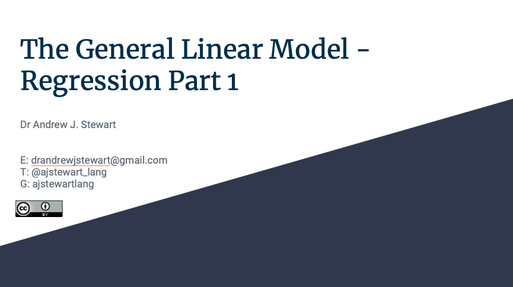

# Overview

## Slides

If you have a Google account, you can also view and download the slides in a range of formats by clicking on the image below. If you don't have a Google account, you can download the slides in .pdf format by [clicking here](../slides/glm_pt1.pdf).

&nbsp;&nbsp;

[{width=75%}](https://docs.google.com/presentation/d/15xUNxg2yGOWWKHH16fYPUF9SEdCV7LU4zTeWQcnLxV8/edit?usp=sharing)

&nbsp;&nbsp;

## Improve this Workshop

If you spot any issues/errors in this workshop, you can raise an issue or create a pull request for [this repo](https://github.com/ajstewartlang/09_glm_regression_pt1). 

